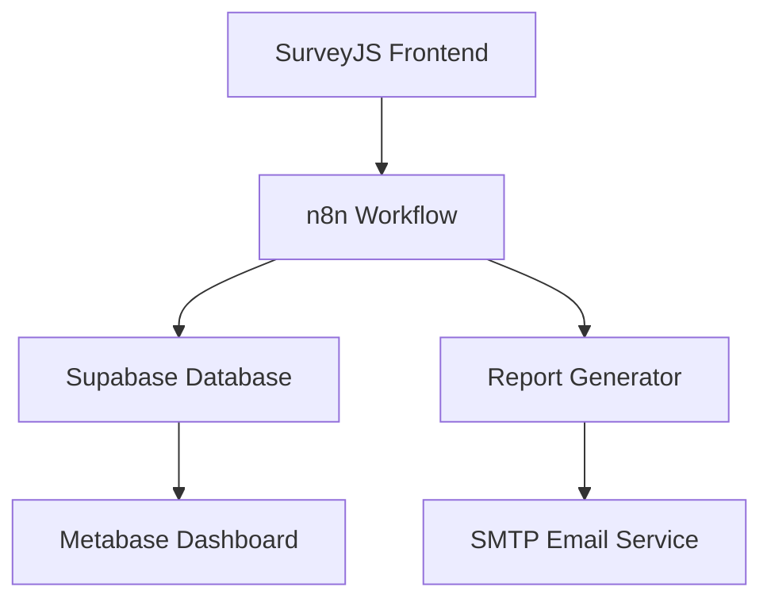

# Supply Chain Resilience Survey Platform (Integrated with Local AI Stack)

This system collects supply chain survey data, generates reports, and delivers them via email — fully self-hosted using components from the [local-ai-packaged](https://github.com/coleam00/local-ai-packaged) stack.

---

## 🧩 Architecture Overview (All tools from local-ai-packaged)


## ⚙️ Tools Used (All from Local AI Packaged)

| Component            | Tool                  |
|----------------------|-----------------------|
| Survey Frontend      | SurveyJS (static HTML)|
| Workflow Engine      | n8n                   |
| Database             | Supabase (PostgreSQL) |
| Report Generator     | Python or Shell (inside n8n) |
| Email Delivery       | n8n SMTP node         |
| LLM Option (future)  | Ollama                |
| Vector DB (optional) | Qdrant                |
| Dashboard (optional) | Add Metabase manually |
| HTTPS + Routing      | Caddy                 |

---

## 🧭 Setup Steps

1. **Provision the stack**  
   Clone and run the `start_services.py` from `local-ai-packaged`.

2. **Configure DNS via Cloudflare**  
   Point subdomains (`n8n.yourdomain.com`, etc.) to your cloud instance.

3. **Host the survey**  
   Serve the static SurveyJS wizard with Caddy or GitHub Pages.

4. **Build your workflow in n8n**  
   - HTTP Webhook receives survey data  
   - Store data in Supabase  
   - Trigger script to generate report (HTML or PDF)  
   - Send via SMTP  

5. **Optional: Add Metabase dashboard**  
   Deploy Metabase in `docker-compose.override.yml` and connect to Supabase.

6. **Optional: Enable AI Enhancements**  
   - Use Ollama to summarize answers  
   - Use Qdrant for semantic search or question answering  
   - Use Flowise to build local agents  

---

## 🧾 Minimum Workflow (n8n)

1. `HTTP Webhook` → Receives JSON from survey form  
2. `Postgres Insert` → Saves data to Supabase  
3. `Execute Command` → Runs local script to generate report  
4. `Email` → Sends report as attachment

---

## 🔒 Security Notes

- No user auth is enabled in first version  
- No external services are used (fully local)  
- All services are containerized via Docker  
- TLS is managed via Caddy using Let’s Encrypt

---

## 📦 Folder Structure Suggestion

```
/survey/               # Static SurveyJS files
/workflows/            # Exported n8n workflows
/reports/              # Output PDFs/HTML reports
/scripts/              # Report generation scripts
.env                   # Environment configuration
README.md              # This file
```

---

## 📬 Next Steps

- [ ] Host SurveyJS form via Caddy
- [ ] Build and test n8n workflow
- [ ] Store form results in Supabase
- [ ] Generate and send reports
- [ ] Optionally connect Metabase or AI extensions

