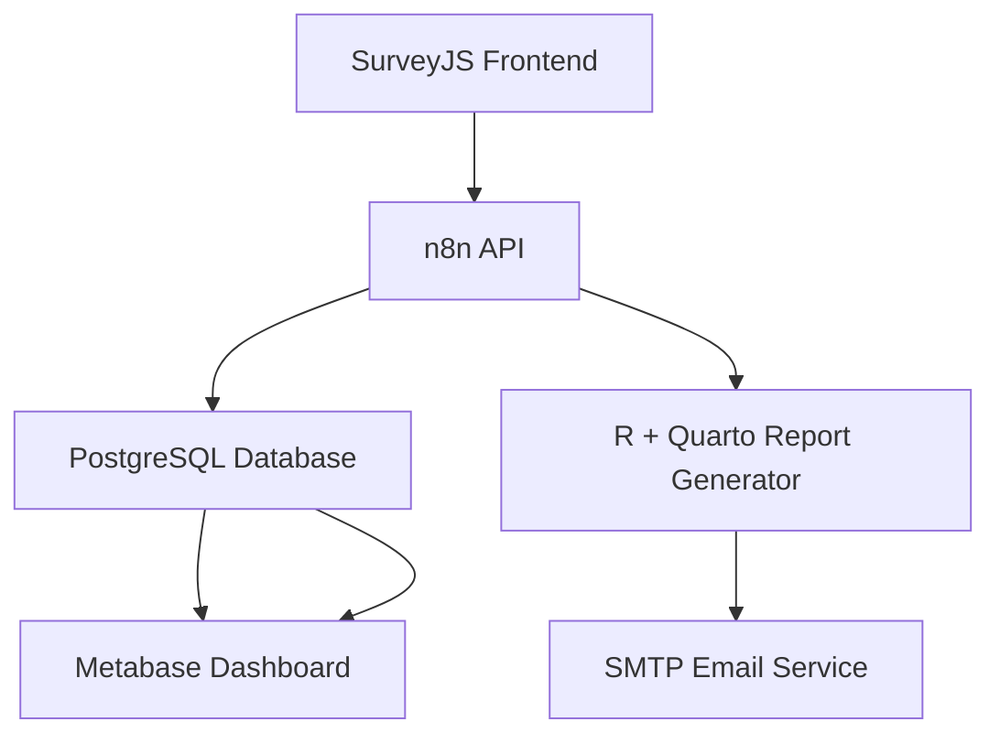

# 📦 Supply Chain Resilience Survey Platform (Open Source, Self-Hosted)

This project deploys a **self-hosted**, open-source platform for:

- ✅ Collecting supply chain resilience survey responses  
- 📄 Automatically generating personalized PDF/HTML reports  
- 📬 Emailing results directly to users  
- 📊 Feeding responses into an admin dashboard  
- 🔮 Future-proofing for AI insights (optional)

> All components are **open-source**, **privacy-first**, and **modular**. Initial deployment runs on an **Oracle Cloud Free VPS** using Docker.

---

## 🧩 Architecture Overview

---

## ⚙️ Technologies Used

| Component        | Tool                          |
|------------------|-------------------------------|
| Survey UI        | SurveyJS (hosted on GitHub)   |
| Workflow Engine  | n8n                            |
| Data Storage     | PostgreSQL                    |
| Report Generation| R + Quarto                    |
| Dashboard        | Metabase                      |
| HTTPS & Routing  | Caddy                         |
| Hosting          | Oracle Cloud Free Tier VPS    |

---

## 🚀 Minimal Viable Setup (Phase 1)

1. 🔧 Set up Oracle Free VPS (Ubuntu/Debian)
2. 🐳 Install Docker and Docker Compose
3. ⚙️ Deploy stack: n8n, PostgreSQL, Metabase, Caddy
4. 🌐 Host survey frontend (SurveyJS) on GitHub Pages
5. 🔄 Create webhook in n8n to receive survey data
6. 📥 Store responses in PostgreSQL
7. 📄 Generate report using R + Quarto
8. ✉️ Send PDF/HTML to user via SMTP (in n8n)
9. 📊 Visualize responses with Metabase dashboard

---

## 🔮 Future Enhancements (Optional)

- Add self-hosted AI for summaries or risk scoring
- Enable authentication on n8n and Metabase
- Create public dashboards or export to CSV
- Store versioned reports per respondent
- Integrate university login or research tracking

---

## ✅ Key Benefits

- Fully open-source, transparent, and extensible
- Own and control all data (compliant with privacy laws)
- Minimal hosting requirements (free VPS possible)
- Based on Docker Compose for simple deployment
- Academic- and research-friendly architecture

---

## 📬 Immediate Next Steps

- [ ] Deploy Docker Compose stack on VPS  
- [ ] Configure DNS and HTTPS with Cloudflare + Caddy  
- [ ] Connect GitHub Pages survey to n8n webhook  
- [ ] Create first report template in R Markdown or Quarto  
- [ ] Review results and track responses in Metabase

---

> Created by **Value Chain Hackers** – supporting open research infrastructure for supply chain sustainability.
